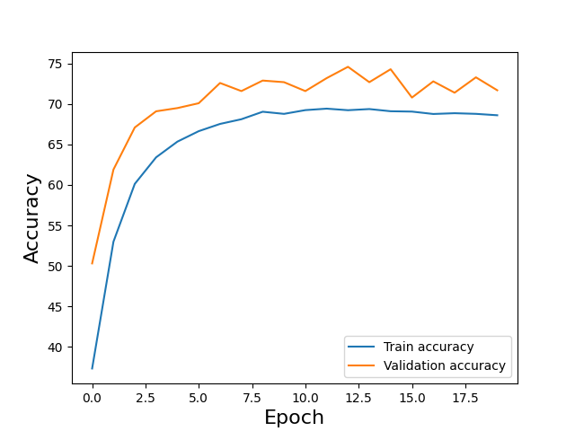
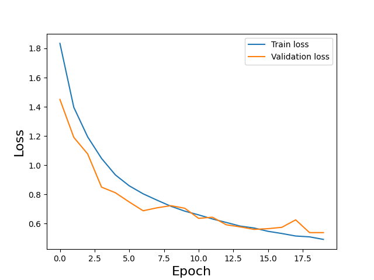

# ConvNet

A Convolutional neural network for image classification (CIFAR-10).

## Pre-processing
The dataset CIFAR10 in torchvision provides images with values between
0 and 1, but they are not normalized to have zero mean and unit variance, so a PyTorch Transforms is used.

Furthermore. the original dataset does not have a validation set so a SubsetRandomSampler is used.

## Layers
The convolutional neural network uses rectified linear activation
functions (ReLUs) as activation function. It has the following layers:
- 2 x Convolutional layer
- 1 x Max-pooling layer
- 2 x Convolutional layer
- 1 x Max-pooling layer
- 1 Fully connected layer: 512 units

## Main
- `show_9_images` is a function that takes the first 9 images and plot them in order to better understand the dataset, by visualizing some samples.
- `run` is the function that run the model with the default values (`num_epochs = 20, batch_size = 32, learning_rate = 10e-3, momentum = 0.9, kernel_size = 3`)
- `find_best_channels_momentum_kernel` is a function that try different hyperparameters in order to find the ones that provide the higher accuracy.
- `best_run` runs the CN with the preset better hyperparameters provided by the  `find_best_channels_momentum_kernel` function.

## Results
### Default configuration without dropout
Test accuracy is: 69.72 %.

The best epoch is the 3, with a validation accuracy equals to 74.8 %.

### Default configuration with dropout
Test accuracy is: 71.15 %.

The best epoch is the 12, with a validation accuracy equals to 74.6 %.

### Best configuration with dropout
Best channel 1 value: 82. Best channel 2 value: 64. Best momentum value: 0.7. Best kernel size: 3.

Test accuracy is: 81.39 %.

The best epoch is the 19, with a validation accuracy equals to 82.1 %.

